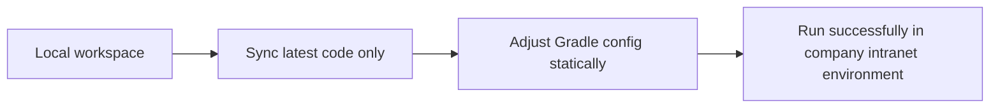

# Gradle Migration Context

## Confirmed background constraints

- The final goal is not "make the project compile locally on this machine".
- The local workspace is used primarily to sync and edit code before moving the project into the company intranet environment.
- A local build succeeding does not prove the project can run in the company intranet environment.
- The company intranet environment is the real target runtime and dependency-resolution environment.
- The `gradle/wrapper` properties have already been aligned by the user with a company-verified wrapper configuration.
- The remaining debug focus should stay on Gradle build files and related configuration, especially repository resolution, plugin resolution, Java version declaration, and IDE import behavior.
- The IntelliJ import failure shown by the user is a Gradle Java toolchain resolution problem, not yet evidence of business-code or application-runtime failure.
- The latest upstream version of this repository replaced Maven with Gradle wrapper, so all follow-up changes need to be evaluated on top of that migration.

## Working assumptions for follow-up changes

- Prefer static configuration alignment with known company Gradle wrapper projects over local compilation experiments.
- Keep the active project build files minimal and targeted; do not copy the full company sample build wholesale unless a section clearly maps to this project.
- Use the company sample `build.gradle` as a reference source, not as a direct drop-in replacement for this repository.
